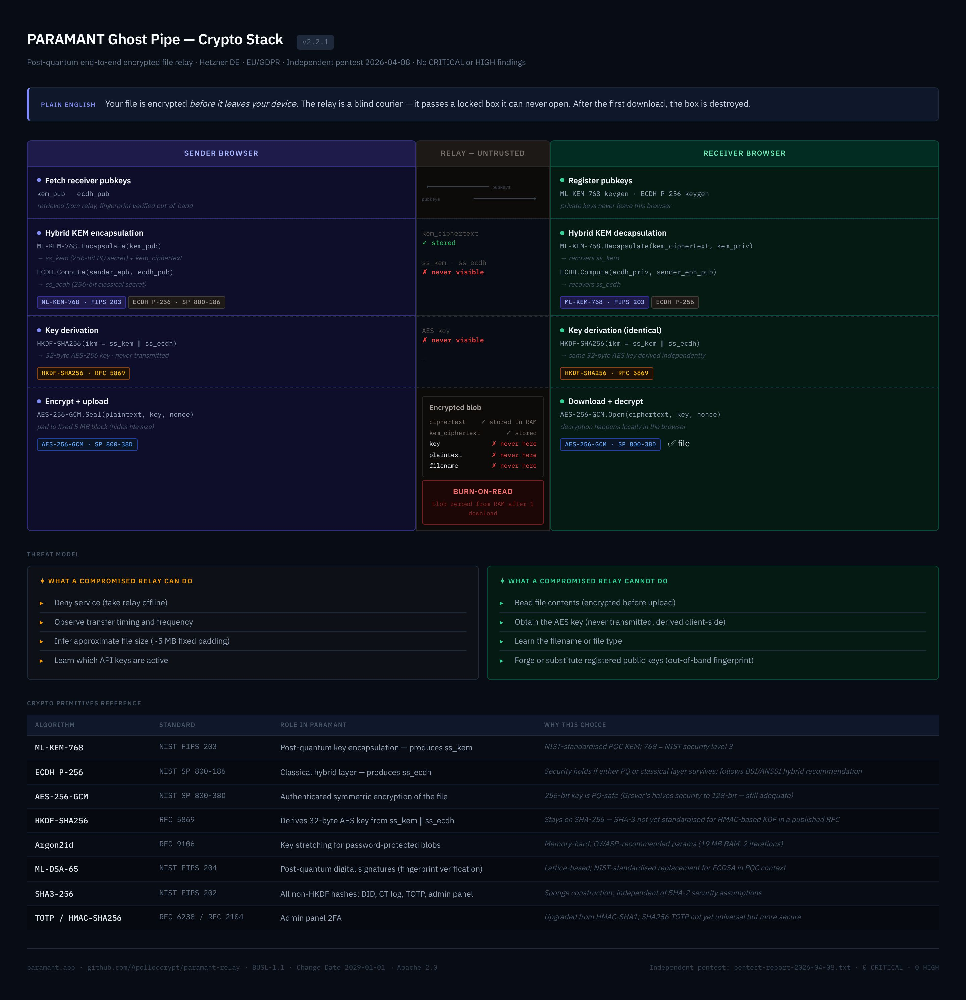

# PARAMANT Ghost Pipe

**Post-quantum encrypted file relay. Encrypted before it leaves your device. Destroyed after one download.**

[](LICENSE)
[](CHANGELOG.md)
[](https://hub.docker.com/r/mtty001/relay)
[](https://hub.docker.com/r/mtty001/relay)
[](docs/security-audit-2026-04.md)

- **Zero plaintext** — ML-KEM-768 + AES-256-GCM encryption happens in the browser, before upload
- **Burn-on-read** — blob is zeroed from RAM after the first download
- **RAM-only blobs** — encrypted payload data is never written to disk; only cryptographic hashes (CT log) and API key config are persisted
- **Self-hostable** — Community Edition free forever, up to 5 users, one `docker compose up`

---

## Two ways to use PARAMANT

| | **Managed relay** | **Self-hosted relay** |
|---|---|---|
| **Who** | End users — send/receive files | Teams / operators — run your own relay |
| **Key type** | `pgp_` API key | `plk_` license key (only if > 5 users) |
| **Free tier** | 10 uploads/day, 1-hour TTL | Community Edition — unlimited for ≤ 5 users |
| **Get started** | [Request a free key →](mailto:privacy@paramant.app?subject=Free+API+key+request) | [Self-host ↓](#self-host) |

---

## Managed relay — no install

**[Try ParaShare →](https://paramant.app/parashare)** — browser-based, no account needed.

Or request a `pgp_` API key to use with the SDK:

```
Email: privacy@paramant.app
Subject: Free API key request
→ Returns: pgp_<key>  — no account, no credit card
```

| Plan | Uploads/day | TTL | |
|------|-------------|-----|---|
| Free | 10 | 1 hour | [Request key](mailto:privacy@paramant.app?subject=Free+API+key+request) |
| Pro | Unlimited | 24 hours | [paramant.app/pricing](https://paramant.app/pricing) |
| Enterprise | Unlimited | 7 days | [Contact us](mailto:privacy@paramant.app) |

---

## Self-host

Two options — pick one:

### Option A — ParamantOS (bootable ISO, easiest)

**[→ Download ParamantOS ISO](https://github.com/Apolloccrypt/ParamantOS/releases/latest)**

Flash to USB, plug in, boot. The relay starts automatically — no Linux, no Docker, no package manager needed. Purpose-built NixOS image with the relay baked in, SSH hardened, firewall pre-configured.

```bash
# Flash to USB (replace /dev/sdX with your drive)
sudo dd if=ParamantOS.iso of=/dev/sdX bs=4M status=progress && sync
# Boot → relay is live on port 3000
curl http://YOUR_IP:3000/health
```

> Best for: bare-metal servers, dedicated hardware, edge deployments, air-gapped setups.  
> Source & build instructions: [Apolloccrypt/ParamantOS](https://github.com/Apolloccrypt/ParamantOS)

---

### Option B — Docker (Linux VPS / Raspberry Pi)

**Raspberry Pi / Linux VPS** (~2 minutes):

```bash
git clone https://github.com/Apolloccrypt/paramant-relay
cd paramant-relay
cp .env.example .env && echo "ADMIN_TOKEN=$(openssl rand -hex 32)" >> .env
docker compose up -d
```

Starts 6 containers: 5 sector relays (main / health / legal / finance / iot), an admin panel. System nginx handles TLS termination.

| Container | Internal port | Host port | Domain |
|-----------|--------------|-----------|--------|
| relay-main | 3000 | 127.0.0.1:3000 | relay.paramant.app |
| relay-health | 3000 | 127.0.0.1:3001 | health.paramant.app |
| relay-finance | 3000 | 127.0.0.1:3002 | finance.paramant.app |
| relay-legal | 3000 | 127.0.0.1:3003 | legal.paramant.app |
| relay-iot | 3000 | 127.0.0.1:3004 | iot.paramant.app |
| admin | 4200 | 127.0.0.1:4200 | /admin/ |

**Architecture:** One shared codebase (`relay/relay.js`) builds into all five relay containers. The `SECTOR` environment variable tells each container which sector it is — no separate codebases, one file to maintain:

```
relay/relay.js ──(build: ./relay)──► relay-main    (SECTOR=relay)    :3000
                                  ► relay-health  (SECTOR=health)   :3001
                                  ► relay-finance (SECTOR=finance)  :3002
                                  ► relay-legal   (SECTOR=legal)    :3003
                                  ► relay-iot     (SECTOR=iot)      :3004
```

System nginx handles TLS termination and routes each subdomain to the matching container port:

```
Internet → nginx (443)
  relay.your-domain    → 127.0.0.1:3000
  health.your-domain   → 127.0.0.1:3001
  finance.your-domain  → 127.0.0.1:3002
  legal.your-domain    → 127.0.0.1:3003
  iot.your-domain      → 127.0.0.1:3004
  your-domain/admin/   → 127.0.0.1:4200
```

**Dockerfile** uses a two-stage build: stage 1 compiles `argon2` native bindings (needs `python3`/`make`/`g++`), stage 2 is a lean runtime image with only `node_modules` + `relay.js` — no build tools in production.

**To upgrade** after a code change:
```bash
git pull
# Copy updated relay.js into the Docker build context, then rebuild
cp relay/relay.js /opt/paramant-relay/relay/relay.js   # or wherever docker-compose.yml lives
docker compose build relay-main relay-health relay-finance relay-legal relay-iot
docker compose up -d
# Named volumes (users.json, CT log, relay identity) are preserved across rebuilds
```

Or add a shell alias for one-command deploy:
```bash
alias paramant-deploy='rsync relay/relay.js root@YOUR_SERVER:/opt/paramant-relay/relay/relay.js && ssh root@YOUR_SERVER "cd /opt/paramant-relay && docker compose build relay-main relay-health relay-finance relay-legal relay-iot && docker compose up -d"'
```

**First user (after deploy):**

```bash
export $(grep -v '^#' .env | xargs)

# Create your admin key
python3 scripts/paramant-admin.py add --label "admin" --plan enterprise --email you@example.com
python3 scripts/paramant-admin.py sync

# Admin panel → https://your-domain/admin/
# Login: ADMIN_TOKEN + 6-digit TOTP code
```

Community Edition is **free forever** for up to 5 users. No license key required.
For unlimited users, add a `plk_` relay license to `.env`. → [docs/licensing.md](docs/licensing.md)

| Edition | Users | Enforcement | Price |
|---------|-------|-------------|-------|
| Community | Up to 5 | Hard cap — 6th key returns HTTP 402 | Free |
| Licensed | Unlimited | Ed25519-signed key, verified in-process | [paramant.app/pricing](https://paramant.app/pricing) |
| Enterprise | Unlimited + SLA | Ed25519-signed key | [Contact us](mailto:privacy@paramant.app) |

**Security note:** `plk_` license keys are Ed25519-signed with a private key held offline
by Paramant. They cannot be forged, modified, or replicated. An invalid or expired key
falls back to Community Edition gracefully — the relay never crashes on a bad key.

Full Docker deploy guide: [docs/self-hosting.md](docs/self-hosting.md)  
Bootable ISO (no Docker): [Apolloccrypt/ParamantOS](https://github.com/Apolloccrypt/ParamantOS)

---

## Python SDK

```bash
pip install paramant-sdk
```

```python
from paramant_sdk import GhostPipe

gp    = GhostPipe(api_key="pgp_...", device="my-device")
hash_ = gp.send(b"secret data", ttl=3600, max_views=1)
data  = gp.receive(hash_)

mnemonic = gp.drop(b"sensitive data", ttl=3600)   # 12-word anonymous drop
data     = gp.pickup(mnemonic)
```

---

## Security

The relay is **untrusted by design** — it never holds a decryption key.

| What a compromised relay can do | What it cannot do |
|---------------------------------|-------------------|
| Deny service | Read file contents |
| Learn transfer timing | Substitute a registered public key |
| See blob sizes (fixed 5 MB padding) | Decrypt any stored ciphertext |

| Stack | Standard |
|-------|----------|
| Key encapsulation | ML-KEM-768 · NIST FIPS 203 |
| Symmetric | AES-256-GCM · NIST SP 800-38D |
| Signatures | ML-DSA-65 · NIST FIPS 204 |
| Key derivation | HKDF-SHA256 · RFC 5869 |
| Password blobs | Argon2id · RFC 9106 |
| Crypto runtime | Rust/WASM (wasm-pack) — browser-side encrypt runs in native code, not JS |
| Jurisdiction | Hetzner DE · EU/GDPR · no US CLOUD Act |

**Independent security audit (April 2026):** [Ryan Williams](https://github.com/scs-labrat) · Smart Cyber Solutions Pty Ltd (AU) · uncompensated, voluntary review
Findings: **4 critical · 5 high** · 6 medium · 5 low · [Full report](pentest-report-2026-04-08.txt) · [Patch status →](docs/security-audit-2026-04.md)

**v2.4.2 (April 2026):** Relay registry:
- Each relay generates an ML-DSA-65 identity keypair on first boot (`/data/relay-identity.json`)
- `POST /v2/relays/register` — signed self-registration appended to CT log (public, no API key)
- `GET /v2/relays` — public relay discovery: url, sector, version, edition, `verified_since`, `pk_hash`
- ct-log.html: "Registered Relays" tab; paramant-scan queries registry before nmap
- SDK-JS 2.4.2: CJS+ESM dual exports (`require()` + `import`)

**v2.4.1 (April 2026):** ParaShare end-to-end flow restored:
- `ghost_pipe` mode: `/v2/ws-ticket` added to ALLOWED paths
- WS ticket URL fixed — fetched from relay-main (same host as WS connection)
- Receiver keypair generation unblocked — `mlkem-ready` event dispatched on `window` not `document`
- Receiver pubkey registration decoupled from WS — HTTP POST now happens before WS attempt
- Admin panel CSP: `'unsafe-inline'` restored for JS-rendered UI
- nginx: `'wasm-unsafe-eval'` added to CSP, `no-store` cache-control for JS/WASM files

**v2.4.0 (April 2026):**
- **Docker architecture**: one shared relay codebase → 5 sector containers (compartmentalisation)
- All browser crypto (parashare, drop, ontvang) migrated to **Rust/WASM** via `crypto-bridge.js`
- WASM self-integrity: SHA-256 of `paramant_crypto_bg.wasm` verified at runtime before first use
- WASM binary committed to git (`frontend/pkg/`) — no Rust toolchain needed to self-host
- `noble-mlkem-loader.js` retained only for keypair generation (keygen not in WASM)
- `scripts/deploy.sh` added for one-command server deploy

**v2.3.6 hardening (April 2026):**
- CSP: `unsafe-inline` removed from `script-src`/`style-src`; `wasm-unsafe-eval` added for WASM
- SRI `sha384` integrity hashes on all local `<script>` tags
- `Strict-Transport-Security`, `Referrer-Policy: no-referrer`, `Permissions-Policy` on all responses
- Encrypt path in browser migrated from JS to **Rust/WASM** (`crypto-wasm/`, 112 KB `.wasm`)
- JS build pipeline: terser + javascript-obfuscator → `frontend/dist/`



---

## Docs

| | |
|--|--|
| [docs/self-hosting.md](docs/self-hosting.md) | Docker deploy, env vars, nginx, TLS, upgrade |
| [docs/licensing.md](docs/licensing.md) | Key types, edition limits, Ed25519 enforcement |
| [docs/security.md](docs/security.md) | Security model — threat model, crypto stack, audit |
| [Apolloccrypt/ParamantOS](https://github.com/Apolloccrypt/ParamantOS) | Bootable NixOS ISO — plug in, boot, relay is live |
| [CHANGELOG.md](CHANGELOG.md) | Version history |
| [SECURITY.md](SECURITY.md) | Vulnerability reporting |

---

**Requirements:** 1 GB RAM · Ubuntu 22.04+ / Debian 12+ · Docker 24+ · swap disabled

**License:** BUSL-1.1 — source available, free for ≤ 5 users.
